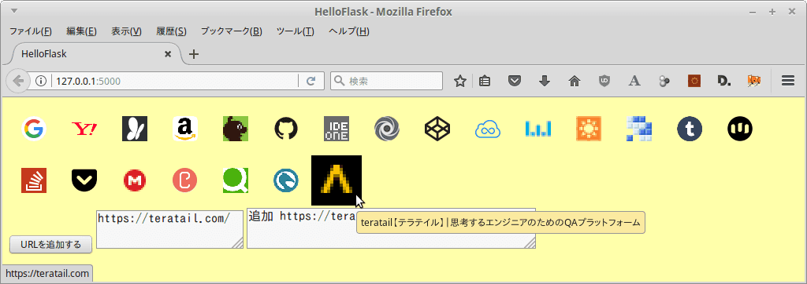

# このソフトウェアについて

ファビコン・コレクター。略してファビコレ。

# 概要

* URLを入力してファビコンを取得する
* DBに保存する
* HTMLに出力することで一覧できる
    * クリックするとリンクへ飛ぶ

# 用途

* ファビコン一覧して収集欲を満たす
* Webサービスのランチャーとして使う

# 使い方

1. ターミナルを起動する
1. `bash run.sh`コマンドを実行する
1. `http://127.0.0.1:5000/`をブラウザで開く

## URLを追加する

1. `URLを1行ずつ入力してください`とあるテキストエリアにURLを入力する
1. `URLを追加する`ボタンを押下する
1. 画面上にファビコンが表示されたら成功

## URLを選択する

* ファビコンにマウスカーソルを合わせる
* [↑],[↓],[←],[→],[TAB],[Shift+TAB]キーを押下する

## URLを参照する

* ファビコンを[クリック]または[Ctrl+クリック]する
* [Enter]または[Ctrl+Enter]キーを押下する

# 開発環境

* インターネット接続環境
* Linux Mint 17.3 MATE
* Python 3.6.1
    * 各種ライブラリ ([ライセンス](#ライセンス)参照)

# 変更履歴

バージョン|リポジトリ名|技術用語|変更概要
----------|------------|--------|--------
201706021605|FaviconGetter.201706021605|Pythonスクリプト、SQLite3、HTML、CSS|PythonスクリプトでWebスクレイピングしてファビコンを取得する
201706051200|FaviconCollector.201706051200|Webサーバ、AJAX、Pythonスクリプト、SQLite|HTMLからURL追加できるようにした
201706060736|FaviconCollector.201706060736|Webサーバ、AJAX、Pythonスクリプト、SQLite|URL追加時1件ずつHTTP要求するようにした
201706060916|FaviconCollector.201706060916|Webサーバ、AJAX、JQuery.Deferred、Pythonスクリプト、SQLite|URL追加時に非同期(並列,同時)に実行するようにした
201706071818|FaviconCollector.201706071818|SVG,CSS|SVG画像を使ってみた。今後UI非表示等の機能追加に使えるか。中途半端だが一旦案件終了。

# 課題

* 更新したい
    * リンク切れチェック
    * ファビコン等の一括自動更新
* インタフェースを改善したい
    * 操作をアイコン表示したい
        * URL追加ダイアログ表示
        * ショートカットキー一覧
    * アニメーションしたい
        * URL追加、選択、参照
* 非同期処理とそのエラー処理を実装したい
    * JQuery.Deferredによる実装にしたい
        * http://qiita.com/yuku_t/items/1b8ce6bba133a7eaeb23

# 解決済みバグ

* URL入力テキストエリアに空行を入れるとログに「既存 」と表示される

# 未解決バグ

* テキストエリアで[↑],[↓],[←],[→]キー押下してもキャレット移動できない
    * ファビコン選択されてしまう

# ライセンス

このソフトウェアはCC0ライセンスである。

なお、使用させていただいたライブラリは以下のライセンスである。感謝。

Library|License|Copyright
-------|-------|---------
[requests 2.17.3](http://requests-docs-ja.readthedocs.io/en/latest/)|[Apache-2.0](https://opensource.org/licenses/Apache-2.0)|[Copyright 2012 Kenneth Reitz](http://requests-docs-ja.readthedocs.io/en/latest/user/intro/#requests)
[bs4 0.0.1](https://www.crummy.com/software/BeautifulSoup/bs4/doc/)|[MIT](https://opensource.org/licenses/MIT)|[Copyright © 1996-2011 Leonard Richardson](https://pypi.python.org/pypi/beautifulsoup4),[参考](http://tdoc.info/beautifulsoup/)
[dataset](https://dataset.readthedocs.io/en/latest/)|[MIT](https://opensource.org/licenses/MIT)|[Copyright (c) 2013, Open Knowledge Foundation, Friedrich Lindenberg, Gregor Aisch](https://github.com/pudo/dataset/blob/master/LICENSE.txt)
[Flask 0.12.2](http://flask.pocoo.org/)|[three clause BSD](http://flask.pocoo.org/docs/0.12/license/#flask-license)|[Copyright (c) 2015 by Armin Ronacher and contributors.](http://flask.pocoo.org/docs/0.12/license/)
